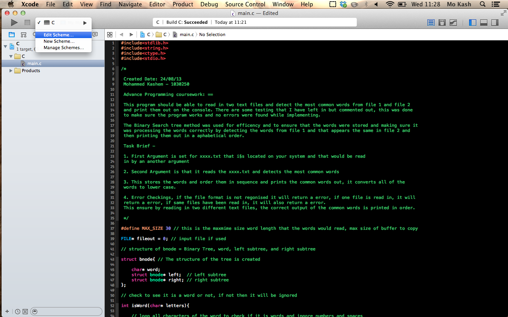

# Detecting Common Words

###Coursework:

Write a C program to determine the set of words two documents have in common. The words in common should be printed out in increasing alphabetical order.

For the purposes of this coursework a document file is an ASCII file. A sequence of the ASCII characters 'a' to 'z' and 'A' to 'Z' without any other characters in between form a word. Any other character can be considered as a space character (so numbers and any other special characters can all be treated as space). Two words are considered equal if they have the same characters in the same sequence and the same length, independent of case.

Your C program must compile on the machines in the Linux lab and should do the following:

1. Read in two documents from two ASCII files whose filenames are given as first and second command line argument.
2. Determine the set of words that occur at least once in both documents.
3. Put these common words in increasing alphabetical order.
4. Print the ordered list of words on the terminal (stdout).
5. Process any error conditions and reactsuitably.


Only use functions from the standard C library and not any other libraries, and do not directly use any code from other sources, but write your own code for the complete functionality.

Try to implement this efficiently with respect to memory and processing speed and document the source code carefully via comments that clearly indicate how you have chosen to solve the problem. Only commented sources and no other documents should be submitted. 

#### Read in files

To enable to read two document, you will require to:

1) Download the txt files - 

```
e.txt
f.txt

```
2) Open the argurment pane demonstrated on picture - 



3) Add the two arguments as demonstrated on picture and run the program - 


#### This should show the multiple time the words appear in each text files
